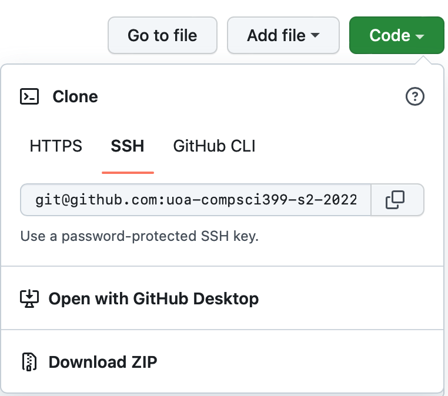
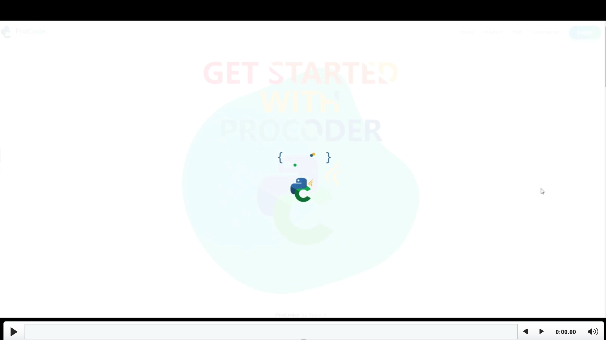

### ProCoder

##### Version: 1.0.0, 23 October, 2022
##### Developers: Team 9, Compsci 399 project, University of Auckland, New Zealand
##### Team Lead: Lingxiu Cai
##### Contributors: Jinhua Fan, Hetong Wang, Fengyuan Ran, Laura Zhou
##### [Here](https://procoderteam.atlassian.net/jira/software/projects/PRO/boards/1) is a link to our Project Management tool.

### Introduction

ProCoder is a tool that allows users to upload their own programming questions, solving others questions and discuss with them in a provided community closely connected to the questions. In order to get rid of the habit of relying on the feedback that coding practice websites gives them, this project is designed to encourage users to make up their own questions and test cases. ProCoder was developed for university computer science students to conveniently make that happen. ProCoder could be useful for all learners that wish to develop their programming skills or simply get into a community where everyone is posting exercises and solving those provided by others. 

For further details of our project, please check the [report](readmeReference/report.pdf) out. 

The tools that develop team used can be roughly divided into two parts: 
Back-end database and APIs using C# .NET 6 and test using Postman and Swagger. 
Front-end website using HTML 5 & CSS 3, Bootstrap 5, JavaScript (version ES2022) and JQuey.

### Installation

ProCoder is primarily intended to be used as an online tool, and the development team has deployed the tool to server, which could be accessed through the [link](http://13.210.13.15)

ProCoder is also open for any personal iterations or updates. The following is the instructions for setup on local:

#### Step 01: 

#### Installing the necessary dependencies

##### Visual Studio, C# .NET 6 and Microsoft Entity Framework

[Visual Studio 2022 download](https://visualstudio.microsoft.com/downloads/)
During this process, you can click on the .NET core to install .NET

#### Step 02:

Clone the repository to your machine.

#### Step 03:

Find the sln file in directory `ProCoder/ProCoder/ProCoder.sln`, open it and it would auto set up the project with Visual Studio. 

#### Step 04:

Press `run` in Visual Studio

#### Step 05:

Run `home.html` in directory `ProCoder/Template/home.html`

### Usage Examples (if available).

### Future Plan (Ideas for future releases)

Note: This is the developer team’s thoughts on the future of ProCoder, but as said before, we are open for any updates and iterations.

- Support more languages for the questions (including Java, C, etc.)

- Leaderboard badges with more details (i.e. the badges will show when and which leaderboard), the source file of leaderboard badges are in directory `ProCoder/Template/badges/leaderBadgeEdit.psd`. 
- More user customization options (profile decorations, avatars, etc.), the source file of user avatars are in directory `ProCoder/Template/Photo/avatarsEdit.psd`

- Night mode for the whole website
- Comparison between author's sample solution and user's submitted solution
- Author changing the question details after posted
- Users who solved the question will have permission to add more test cases
- Users who solved the question can post highlighted comments in discussion area, to clarify the question description or leave some hints. 
- Users who solved the question will be able to rate the question
- Display higher rated questions first
- If an author's questions average rate is too low, we will make this author's questions harder to get discovered. 
- Make posted questions viewable from profile, and make profile viewable for anyone to access (from leaderboard links). 
- All users can add solving tags for a question, and the number of each tag this question recieves will be show in this question's detail page. (i.e. an author labelled a question as 'easy', and 1 people out of 100 can solve it, then these 99 people can tag this question as 'too hard' or 'unsolvable' with a failed submission)
- Custom tags

- Generate test paper (with user’s choice of difficulty, tag, language and number of questions) and choose the top rated questions. 

- More variations of leaderboard will be introduced, like most rated questioner, most liked communicator etc. 
- Better calculation formula for the points, reward users who get positive feedback (getting high ratings, comments getting follow-ups or getting likes)

### Acknowledgements
[Jobe Server](https://github.com/trampgeek/jobe)

[Bootstrap 5](https://getbootstrap.com/docs/5.0/getting-started/introduction/)

[JQuery](https://www.w3schools.com/jquery/default.asp)

[W3schools](https://www.w3schools.com)

[.NET 6](https://dotnet.microsoft.com/en-us/download/dotnet/6.0)

[migrations](https://docs.microsoft.com/en-us/ef/core/managing-schemas/migrations/?tabs=dotnet-core-cli)

[authentication](https://learn.microsoft.com/en-us/aspnet/core/security/authentication/?view=aspnetcore-6.0)

[Monaco Editor](https://microsoft.github.io/monaco-editor/)

[ACE](https://ace.c9.io/)

[Apache ECharts](https://echarts.apache.org/zh/index.html)

[Animate.css](https://animate.style/)
